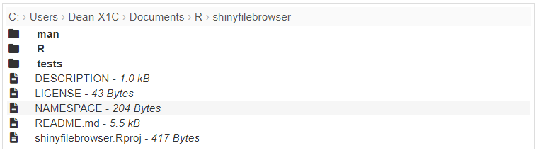
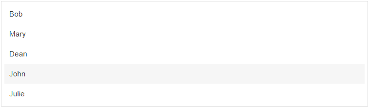

# shinyfilebrowser

**Fully functional, but the documentation is a work in progress**

There are three modules in this package. All use the same interface but have slightly different use cases:
1. file_browser is for browsing a file system
2. path_browser is for browsing an arbitrary set of path
3. list_selector is to select an item from a list. 

Screenshot of file browser



Screenshot of list selector



## Example 1: file browser from the current working directory, the user cannot navigate above the working directory.

```r
library(shiny)
library(shinyfilebrowser)

ui <- fluidPage(
  "Current path:",
  textOutput("cur_wd", inline = TRUE), br(),
  "Selected file:",
  textOutput("selected", inline = TRUE), br(),
  file_browser_ui("files")
)

server <- function(input, output, session) {
  filebrowser <- file_browser_server("files")
  output$cur_wd <- renderText({
    filebrowser$path()
  })
  output$selected <- renderText({
    filebrowser$selected()
  })
}

shinyApp(ui, server)
```

## Example 2: file browser starting at the user's home but allowing the user to navigate anywhere in the file system.

```r
library(shiny)
library(shinyfilebrowser)

ui <- fluidPage(
  "Current path:",
  textOutput("cur_wd", inline = TRUE), br(),
  "Selected file:",
  textOutput("selected", inline = TRUE), br(),
  file_browser_ui("files")
)

server <- function(input, output, session) {
  filebrowser <- file_browser_server("files", path = "~", root = NULL)
  output$cur_wd <- renderText({
    filebrowser$path()
  })
  output$selected <- renderText({
    filebrowser$selected()
  })
}

shinyApp(ui, server)
```

## Example 3: list selector used to select an item from a list

```r
library(shiny)
library(shinyfilebrowser)

names <- c("Bob", "Mary", "Dean", "John", "Julie")

ui <- fluidPage(
  "Selected:",
  textOutput("selected", inline = TRUE), br(),
  list_selector_ui("names")
)

server <- function(input, output, session) {
  listsel <- list_selector_server("names", choices = names)
  output$selected <- renderText({
    listsel()
  })
}

shinyApp(ui, server)
```

## Example 4: path browser used to select an item from a "tree"

```r
library(shiny)
library(shinyfilebrowser)

paths <- c(
  "vehicles/planes/boeing/747",
  "vehicles/planes/boeing/737",
  "vehicles/planes/airbus/A320",
  "vehicles/planes/airbus/A380",
  "vehicles/cars/honda/civic",
  "vehicles/cars/mazda/mazda 3",
  "vehicles/cars/mazda/mazda cx5",
  "vehicles/cars/toy car",
  "vehicles/train",
  "vehicles/bicycle",
  "countries/france",
  "countries/spain",
  "countries/usa/new york",
  "countries/usa/california",
  "fruits",
  "drinks"
)

ui <- fluidPage(
  "Current path:",
  textOutput("cur_wd", inline = TRUE), br(),
  "Selected:",
  textOutput("selected", inline = TRUE), br(),
  path_browser_ui("paths")
)

server <- function(input, output, session) {
  pathbrowser <- path_browser_server("paths", paths = paths)
  output$cur_wd <- renderText({
    pathbrowser$path()
  })
  output$selected <- renderText({
    pathbrowser$selected()
  })
}

shinyApp(ui, server)
```

## Example 5: using different paramters - most of them can be reactive

```r
library(shiny)
library(shinyfilebrowser)

ui <- fluidPage(
  "Current path:",
  textOutput("cur_wd", inline = TRUE), br(),
  "Selected file:",
  textOutput("selected", inline = TRUE), br(),
  checkboxGroupInput(
    "options", NULL, inline = TRUE,
    c("Show path" = "show_path", "Show extensions" = "show_extension", "Show file size" = "show_size",
      "Show icons" = "show_icons", "Include hidden files" = "include_hidden", "Include empty files" = "include_empty", "Clear selection when navigating" = "clear_selection_on_navigate"
    ),
    c("show_path", "show_extension", "show_size", "show_icons", "include_hidden", "include_empty", "clear_selection_on_navigate")
  ),
  selectInput("extensions", "Extensions", c("Any file" = "", ".csv", ".R", ".xlsx", ".md"), multiple = TRUE),
  textInput("text_parent", "Parent directory text", ".."),
  textInput("text_empty", "Empty directory text", "No files here"),
  file_browser_ui("files")
)

server <- function(input, output, session) {
  filebrowser <- file_browser_server(
    "files",
    path = "~",
    root = "~",
    extensions = reactive(input$extensions),
    show_path = reactive("show_path" %in% input$options),
    show_extension = reactive("show_extension" %in% input$options),
    show_size = reactive("show_size" %in% input$options),
    show_icons = reactive("show_icons" %in% input$options),
    include_hidden = reactive("include_hidden" %in% input$options),
    include_empty = reactive("include_empty" %in% input$options),
    text_parent = reactive(input$text_parent),
    text_empty = reactive(input$text_empty),
    clear_selection_on_navigate = reactive("clear_selection_on_navigate" %in% input$options)
  )
  output$cur_wd <- renderText({
    filebrowser$path()
  })
  output$selected <- renderText({
    filebrowser$selected()
  })
}

shinyApp(ui, server)
```

## Example 6: using a named list (providing a named list will use the names as what the use sees and the values as the return value. It also forces the list to be flat and you cannot navigate beyond the top level.)

```r
library(shiny)
library(shinyfilebrowser)

nums <- c("Number One" = "one", "Number Two" = "two", "three")

ui <- fluidPage(
  "Selected:",
  textOutput("selected", inline = TRUE), br(),
  list_selector_ui("nums")
)

server <- function(input, output, session) {
  nums <- list_selector_server("nums", choices = nums)
  output$selected <- renderText({
    nums()
  })
}

shinyApp(ui, server)
```

## Example 7: list selector with HTML 

```r
library(shiny)
library(shinyfilebrowser)

names <- c(
  "<div style='color:red'>bobby</div>" = "Bob",
  "<em>Mary</em>" = "Mary",
  " Dean" = "Dean",
  "John", "Julie")

ui <- fluidPage(
  "Selected:",
  textOutput("selected", inline = TRUE), br(),
  list_selector_ui("names")
)

server <- function(input, output, session) {
  listsel <- list_selector_server("names", choices = names, html = TRUE)
  output$selected <- renderText({
    listsel()
  })
}

shinyApp(ui, server)
```

